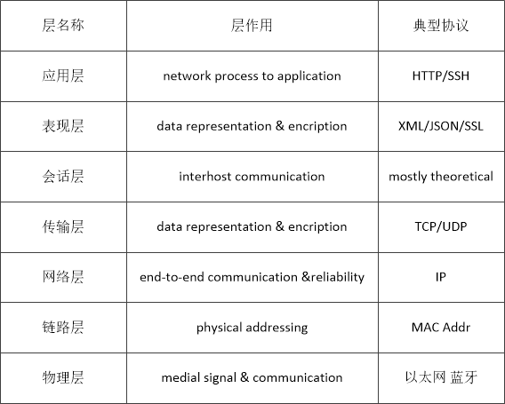

# 分层架构思想

> [Github专栏: 设计模式(UML/23种模式)](https://github.com/media-tm/MTDesignPattern)

分层架构根据职能的差异，划分为多个层次。分层架构设计思想，有很多成功的例子，诸如：OSI七层网络模型，通过七个层次化的结构模型使不同的系统不同的网络之间实现可靠的通讯，因此其最主要的功能就是帮助不同类型的主机实现数据传输。OSI网络模型是理论模型，工业实践中使用的TCP/IP协议，也遵循OSI七层网络模型，只是将OSI的应用层，表示层和会话层归并到应用层而已。

> 计算机科学领域任何问题，都可以间接的通过添加一个中间层来解决

功能分层思想有很多成功的时间比如：Linux操作系统、MVC信息系统架构、物联网ZigBee协议等。功能分层威力可由图灵奖获得者说过的一句话总结：计算机科学领域任何问题，都可以间接的通过添加一个中间层来解决。这句话几乎概括了计算机系统软件体系结构的设计要点，整个体系结构从上到下都是按照严格的层次结构设计的，不仅是计算机系统软件整个体系是这样的，体系里面的每个组件比如OS本身，很多应用程序、软件系统甚至很多硬件结构都是按照这种层次的结构组织和设计的。

## 分层架构实例

### OSI分层架构

开放系统互连参考模型 (Open System Interconnect 简称OSI）是国际标准化组织(ISO)和国际电报电话咨询委员会(CCITT)联合制定的开放系统互连参考模型，为开放式互连信息系统提供了一种功能结构的框架。它从低到高分别是：物理层、数据链路层、网络层、传输层、会话层、表示层和应用层。

OSI模型指定了异构的设备指定了共同的基础和标准框架，并提供了相关标准的一致性和兼容性提供共同的参考。异构计算机设备通过OSI模型可以实现互联互通。国际标准化组织ISO在1979年建立了一个分委员会来专门研究一种用于开放系统的体系结构，提出了开放系统互连OSI模型，这是一个定义连接异种计算机的标准主体结构。OSI采用了分层的结构化技术，共分七层，物理层、数据链路层、网络层、传输层、会话层、表示层、应用层。OSI参考模型具有以下特性：提供了一种异构系统互连的分层结构；提供了控制互连系统交互规则的标准骨架；定义一种抽象结构，而并非具体实现的描述；不同系统中相同层的实体为同等层实体；同等层实体之间通信由该层的协议管理；相信层间的接口定义了原语操作和低层向上层提供的服务；所提供的公共服务是面向连接的或无连接的数据服务；直接的数据传送仅在最低层实现；每层完成所定义的功能，修改本层的功能并不影响其他层。

OSI模型标准封层架构如下图：

### Linux分层架构

Linux分层分为设备驱动层、Linux内核层、系统服务层和应用层。Linux分层基于以下规则：子系统之间自顶向下依赖；上层子系统依赖下层子系统；下层子系统不依赖上层子系统。

Linux设备驱动层借鉴了面向对象设计思想，利用C语言特性实现了类似面向对象的集成功能。这种设计思想极大地提高了代码的可重用能力，是对现实世界事物间关系的一种良好呈现。在设备驱动方面，往往为同类的设备设计了一个框架，而框架中的核心层则实现了该设备通用的一些功能。无法复用的核心函数可以覆盖之。

Linux内核层的核心功能是：抽象化和虚拟化硬件模块，并仲裁多个任务在并行使用计算机硬件资源。现代Linux内核主要包含以下子系统：进程调度器模块、内存管理模块、虚拟文件系统、网络接口模块和进程间通信模块。这些模块之间通过函数调用和共享数据结构进行数据交互。

系统服务层和应用层，不是操作系统的核心特性，属于用户定义级别层次。这里不再详细介绍。

Linux分层架构如下图：

## 系列文章

- [CSDN专栏: 设计模式(UML/23种模式)](https://blog.csdn.net/column/details/27399.html)
- [Github专栏: 设计模式(UML/23种模式)](https://github.com/media-tm/MTDesignPattern)

## 参考文献

- [GOF的设计模式：可复用面向对象软件的基础](http://item.jd.com/10057319.html)
- [设计模式之禅](http://item.jd.com/11414555.html)
- [图说设计模式](https://github.com/me115/design_patterns)
