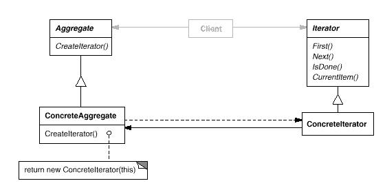

# Iterator模式

迭代器模式(Iterator Pattern): 提供一种方法顺序访问一个聚合对象中各个元素 , 而又不需暴露该对象的内部表示。

Iterator模式属于行为型模式。行为型模式涉及到算法和对象间职责的分配；行为型模式不仅描述对象或类的模式，还描述它们之间的通信模式。行为型模式刻划了在运行时难以跟踪的复杂的控制流；它们将你的注意力从控制流转移到对象间的联系方式上来。行为型模式主要包括：Chain of Responsibility模式、Command模式、Interpreter模式、Iterator模式、Mediator模式、Memento模式、Observer模式、State模式、Strategy模式、Template Method模式和Visitor模式。行为型模式在某种程度上具有相关性。

## 模式简介

GOF的《设计模式》指出Iterator模式的意图是：  
提供一种方法顺序访问一个聚合对象中各个元素 , 而又不需暴露该对象的内部表示。

一个聚合对象, 如列表(list), 应该提供一种方法来让别人可以访问它的元素，而又不需暴露它的内部结构. 此外，针对不同的需要，可能要以不同的方式遍历这个列表。但是即使可以预见到所需的那些遍历操作，你可能也不希望列表的接口中充斥着各种不同遍历的操作。有时还可能需要在同一个表列上同时进行多个遍历。

Iterator模式适用于以下场景：

- 访问一个聚合对象的内容而无需暴露它的内部表示。
- 支持对聚合对象的多种遍历。
- 为遍历不同的聚合结构提供了统一的机制，即支持多态迭代。

## 模式图解

Iterator模式的UML示例如下：

Iterator模式的工作过程如下：

- Iterator类迭代器定义访问和遍历元素的接口。
- ConcreteIterator具体迭代器实现迭代器接口,对该聚合遍历时跟踪当前位置。
- Aggregate类聚合定义创建相应迭代器对象的接口。
- ConcreteAggregate类具体聚合实现创建相应迭代器的接口，该操作返回ConcreteIterator实例。
- ConcreteIterator跟踪聚合中的当前对象，并能够计算出待遍历的后继对象。

Iterator模式的有益效果如下：

- 它支持以不同的方式遍历一个聚合, 复杂的聚合可用多种方式进行遍历。
- 迭代器简化了聚合的接口。
- 在同一个聚合上可以有多个遍历, 每个迭代器保持它自己的遍历状态。

Composite模式: 迭代器常被应用到象复合这样的递归结构上。Factory Method模式：多态迭代器靠Factory Method来例化适当的迭代器子类。Memento模式：常与迭代器模式一起使用。迭代器可使用一个Memento来捕获一个迭代的状态。迭代器在其内部存储Memento。

## 模式实例

迭代器在面向对象系统中很普遍。大多数集合类库都以不同的形式提供了迭代器。

流行的集合类库Boost提供队列(Queue)的固定大小和动态大小的两种实现。队列的接口由抽象的Queue类定义。为了支持多态迭代，队列迭代器的实现基于抽象的Queue类接口。这样做的优点在于，不需要每个队列都实现一个Factory Method来提供合适的迭代器。
但是, 它要求抽象Queue类的接口的功能足够强大以有效地实现通用迭代器。

## 系列文章

- [CSDN专栏: 设计模式(UML/23种模式)](https://blog.csdn.net/column/details/27399.html)
- [Github专栏: 设计模式(UML/23种模式)](https://github.com/media-tm/MTDesignPattern)

## 参考文献

- [GOF的设计模式：可复用面向对象软件的基础](http://item.jd.com/10057319.html)
- [设计模式之禅](http://item.jd.com/11414555.html)
- [图说设计模式](https://github.com/me115/design_patterns)