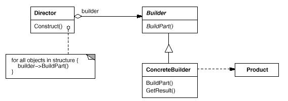

# Builder模式

Builder模式将一个复杂对象的构建与它的表示分离，使得同样的构建过程可以创建不同的表示。Builder模式属于创建型模式，创建型模式包括FactoryMethod模式，AbstactFactory模式，Singleton模式，ProtoType模式和Builder模式。

## 模式简介

Prototype模式和Builder模式、AbstractFactory模式都是通过一个类（对象实例）来专门负责对象的创建工作（工厂对象），它们之间的区别是：Builder模式重在复杂对象的一步步创建（并不直接返回对象），AbstractFactory模式重在产生多个相互依赖类的对象，而Prototype模式重在从自身复制自己创建新类。

GOF的《设计模式》指出构建模式的意图是：  
将一个复杂对象的构建与它的表示分离，使得同样的构建过程可以创建不同的表示。

Builder模式适用于以下场景：

- 当创建复杂对象的算法应该独立于该对象的组成部分以及它们的装配方式时。
- 当构造过程必须允许被构造的对象有不同的表示时。

## 模式图解

构建模式将一个复杂对象的构建与它的表示分离，使得同样的构建过程可以创建不同的表示。构建模式的UML示例如下：

构建模式的工作过程如下：

- Builder类为创建一个Product对象的各个部件指定抽象接口；
- ConcreteBuilder类实现Builder的接口以构造和装配该产品的各个部件;
- ConcreteBuilder类定义并明确它所创建的表示。
- Director类构造一个使用Builder接口的对象。
- Product类表示被构造的复杂对象, ConcreteBuilder创建该产品的内部表示并定义;

原型模式的有益效果如下：

- Builder模式使你可以改变一个产品的内部表示Builder对象提供给导向器一个构造产品的抽象接口。该接口使得生成器可以隐藏这个产品的表示和内部结构。它同时也隐藏了该产品是如何装配的。因为产品是通过抽象接口构造的，你在改变该产品的内部表示时所要做的只是定义一个新的生成器。
- Builder模式将构造代码和表示代码分开。Builder模式通过封装一个复杂对象的创建和表示方式提高了对象的模块性。客户不需要知道定义产品内部结构的类的所有信息；这些类是不出现在Builder接口中的。
- Builder模式使你可对构造过程进行更精细的控制

## 模式实例

[Android中的设计模式之构建者模式](https://yq.aliyun.com/articles/628894)