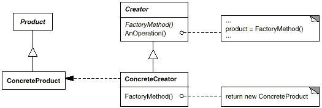

# 工厂方法模式

工厂方法模式又名虚构造器（Virtual Constructor），主要是为创建对象提供了接口，是代替new操作的一种模式。工厂方法模式属于创建型模式，创建型模式包括FactoryMethod模式，AbstactFactory模式，Singleton模式，ProtoType模式和Builder模式。

## 模式简介

GOF的《设计模式》指出工厂方法模式的意图是：  
定义一个用于创建对象的接口，让子类决定实例化哪一个类。 Factory Method使一个类的实例化延迟到其子类。

工厂模式主要是为创建对象提供了接口。工厂模式按照抽象层次可分为以下几类：简单工厂模式(Simple Factory)、工厂方法模式(Factory Method)和抽象工厂模式(Abstract Factory)。工厂模式适合出现了大量的产品需要创建，并且具有共同的接口的场合。

Factory Method模式适用于以下场景：

- 当一个类不知道它所必须创建的对象的类的时候。
- 当一个类希望由它的子类来指定它所创建的对象的时候。
- 当类将创建对象的职责委托给多个帮助子类中的某一个，并且你希望将哪一个帮助子类是代理者这一信息局部化的时候。

## 模式图解

工厂方法模式的UML示例如下：

工厂方法模式的工作过程如下：

- Product类定义工厂方法所创建的对象的接口；
- ConcreteProduct类实现Product接口;
- Creator类声明工厂方法，该方法返回一个Product类型的对象;
- Creator也可以定义一个工厂方法的缺省实现，它返回一个缺省的 ConcreteProduct对象。
- ConcreteCreator重定义工厂方法以返回一个ConcreteProduct实例。

工厂方法模式的有益效果如下：

- 支持子类挂钩(hook)机制。用工厂方法在一个类的内部创建对象通常比直接创建对象更灵活。Factory Method给子类一个挂钩以提供对象的扩展版本。
- 支持连接平行类层次。 在上述示例中，工厂方法只被Creator调用，客户可以找到一些有用的工厂方法，尤其在平行类层次的情况下。

## 模式实例

Android中间件中工厂方法模式应用广泛，例如：

- ${android_sdk_root}/frameworks/av/media/libeffects/factory/EffectsFactory.c
- ${android_sdk_root}/frameworks/av/media/
