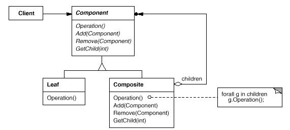

# 组合模式(Composite Pattern)

组合模式(Composite Pattern)将对象组合成树形结构以表示“部分-整体”的层次结构。Composite使得用户对单个对象和组合对象的使用具有一致性。

组合模式(Composite Pattern)属于结构型模式。结构型模式涉及到如何组合类和对象以获得更大的结构；结构型类模式采用继承机制来组合接口或实现。结构型模式主要包括：Adapter模式、Bridge模式、Composite模式、Decorator模式、Facade模式、Flyweight模式和Proxy模式。结构型类模式在某种程度上具有相关性。

## 模式简介

GOF的《设计模式》指出Composite模式的意图是：  
将对象组合成树形结构以表示“部分-整体”的层次结构。Composite使得用户对单个对象和组合对象的使用具有一致性。

在大型的GUI/CAD等绘图引擎中，用户可以使用简单的组件创建复杂的图表。用户可以组合多个简单组件以形成一些较大的组件，这些组件又可以组合成更大的组件。Composite模式让你很容易写一套GUI控件系统。

Composite模式适用于以下场景：

- 你想表示对象的部分-整体层次结构。
- 你希望用户忽略组合对象与单个对象的不同，用户将统一地使用组合结构中的所有对象。

## 模式图解

Composite模式的UML示例如下：

Composite模式的工作过程如下：

- Component类为组合中的对象声明公共接口；并实现共有接口的缺省行为。
- Component类包含访问和管理Component的子组件的接口。
- Leaf类在组合中表示叶节点对象，叶节点没有子节点，在组合中定义图元对象的行为。
- Composite类定义有子部件的那些部件的行为；存储子部件；在Component接口中实现与子部件有关的操作。
- Client类通过Component接口操纵组合部件的对象。
- Client类使用Component接口与组合结构中的对象进行交互；如果接收者是Composite类, 将请求发送给它的子部件。

Composite模式的有益效果如下：

- 定义了包含基本对象和组合对象的类层次结构。组合对象由基本对象构成；组合对象再次聚合构成更加复杂的对象。
- 简化客户代码，客户可以一致地使用组合结构和单个对象。
- 容易增加新类型的组件，并且与原有组件行为一致。
- 使你的设计变得更加一般化，在大型GUI框架，多媒体框架应用广泛。

Decorator模式经常与Composite模式一起使用。当装饰和组合一起使用时，它们通常有一个公共的父类。因此Decorator模式必须支持具有Add、Remove和GetChild等操作的Component接口。

## 模式实例

Android框架中大量使用了Composite模式, 诸如：Android的GUI架构等

- ${android_sdk_root}/frameworks/base/core/java/android/view/View.java
- ${android_sdk_root}/frameworks/base/core/java/android/view/SurfaceView.java
- ${android_sdk_root}/frameworks/base/core/java/android/view/TextureView.java
- ${android_sdk_root}/frameworks/base/core/java/android/view/widget/TextView.java
- ${android_sdk_root}/frameworks/base/core/java/android/view/widget/GridView.java
- ${android_sdk_root}/frameworks/base/core/java/android/view/widget/WebView.java
